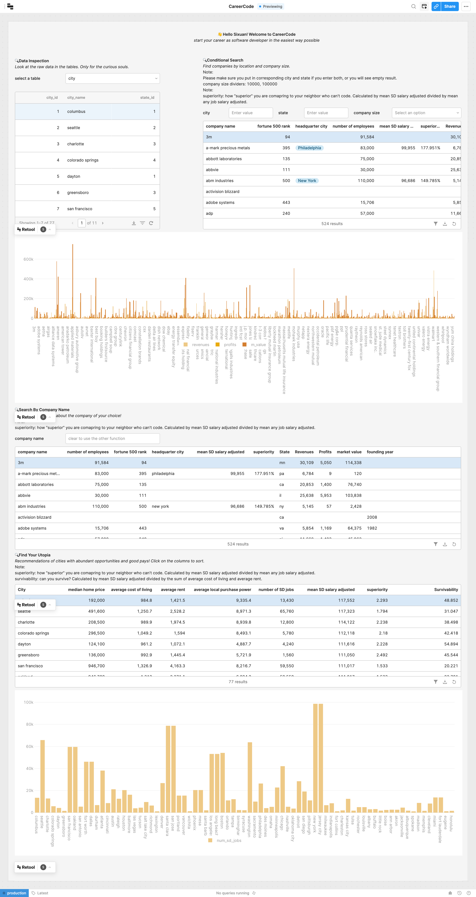

# software_engineering_database: CareerCode

This is the project site for my final project for COSC 61: Database System that I took during summer 2023 with Professor Adam Goldstein. My goal is to find interesting datasets from the internet, design and build a database out of the datasets, and explore findings using SQL queries.

Please checkout the branches for milestone submissions.

Find a video demonstration of the app [here](img/demo.mp4).

### Next steps

- The current UI does not look pretty. Can integrate CSS (I could not figure out how to do that in the low-code platform. I had already spent 10 hours on this task in total by then) to make the front-end look more pretty. Here is a [UI low-fidelity design](img/UI_demo.mp4) that I made with Figma, indicating how it could look like.
- The current website only supports searching by a few attributes. Ideally, the website would enable searching with any of the existing attributes.
- Update: the users could contribute to the database by updating it with the latest information on the companies, city data, etc. Of course, with the permission of the admin.
- Automation: keeps track of relevant datasets and update data automatically when new data is updated (eg. a new release of the fortune 500 rank).
