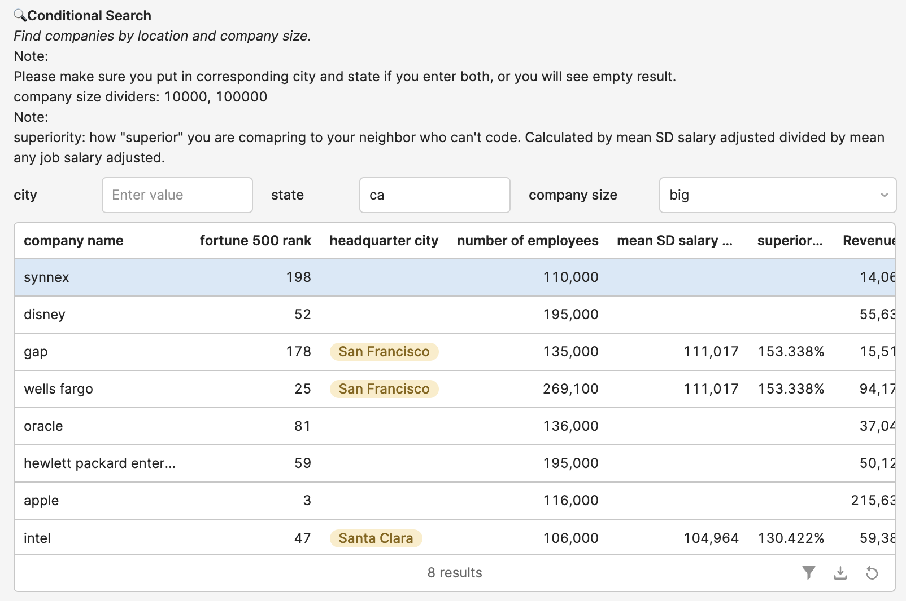
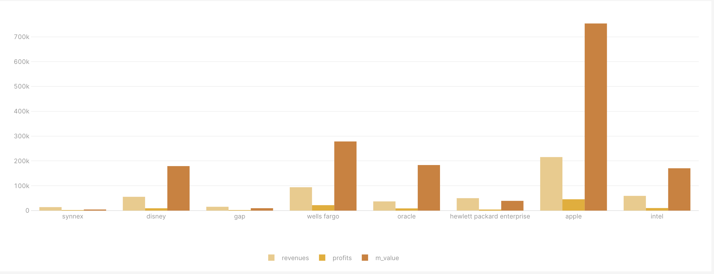
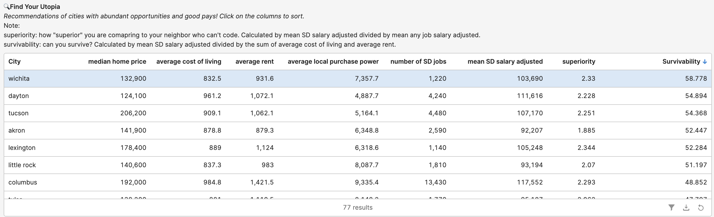
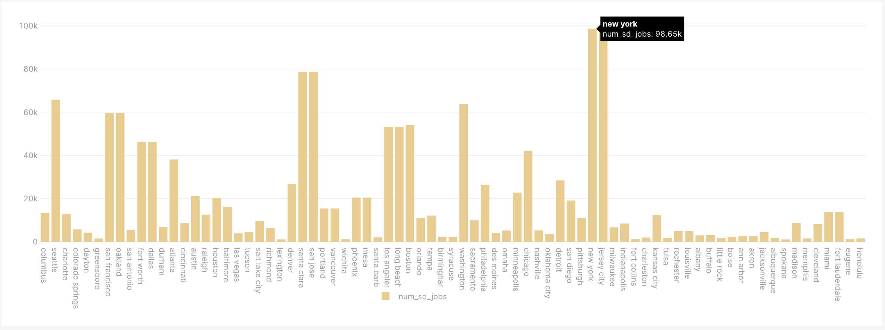

# Results

This document demonstrates how to quickly find answers using either direct queries in MySQL or the website.

1. Show company name, which city its headquarter it is at, and the number of employees of the 15 companies with the most number of employees where the adjusted mean salary for software developers is at least twice the adjusted mean salary for all jobs in the headquarter city.
   
    Result:

    ``` SQL
    SELECT c_name, city_name, num_employees FROM company_name
    NATURAL JOIN company_city
    NATURAL JOIN company_employee
    NATURAL JOIN city
    NATURAL JOIN city_salary
    WHERE mean_sd_salary_adj > 2 * mean_salary_adj
    ORDER BY num_employees DESC
    LIMIT 15;
    ```

    ```
    +-------------------------+------------+---------------+
    | c_name                  | city_name  | num_employees |
    +-------------------------+------------+---------------+
    | kroger                  | cincinnati |        443000 |
    | home depot              | atlanta    |        406000 |
    | berkshire hathaway      | omaha      |        367700 |
    | fedex                   | memphis    |        335767 |
    | ups                     | atlanta    |        335520 |
    | albertsons cos.         | boise      |        274000 |
    | at&t                    | dallas     |        268540 |
    | hca holdings            | nashville  |        210500 |
    | bank of america corp.   | charlotte  |        208024 |
    | darden restaurants      | orlando    |        150942 |
    | macy's                  | cincinnati |        148300 |
    | american airlines group | fort worth |        122300 |
    | tenet healthcare        | dallas     |        116475 |
    | procter & gamble        | cincinnati |        105000 |
    | coca-cola               | atlanta    |        100300 |
    +-------------------------+------------+---------------+
    15 rows in set (0.00 sec)
    ```

    Synthesis:

    If you're a job seeker looking forward to earning much more than your non-software developer neighbors at a large company, these companies are good choices. The data provides valuable insights into the companies that not only lead in terms of employee strength but also offer higher adjusted mean salaries for software developers compared to the mean salaries across all job roles in their headquarter cities. This combination of employee strength and competitive software developer salaries demonstrates these companies' prominence and commitment to fostering a thriving workforce within their respective urban centers.


2. A student is only interested in big companies in California. How can they obtain information quickly?

    Results:

    

    

    Synthesis:

    These 8 companies are all great choices for the student, since they made to the Fortune 500 rankings. Among them, Apple seems like the best choice if we evaluate revenues, profits, and market values.

3. A student does not have preferences in cities currently, but they want to land in a city that has great prospectives for software developers. What are some recommendations?

    Results:

    

    

    Synthesis:

    There are many attributes with which we can evaluate the prospectives of a city. If we care most about "survivability", which I refer to the mean salary for software developers in that city divided by the sum of average cost of living and average rent, we see that Wichata gives an incredible survivability of 58.8. Of course, we need to consider the size of the city and how easy it is to find a job there. The bar graphs show the number of software development jobs in the city, and we can see that New York and Jersey City both have a lot of jobs available.